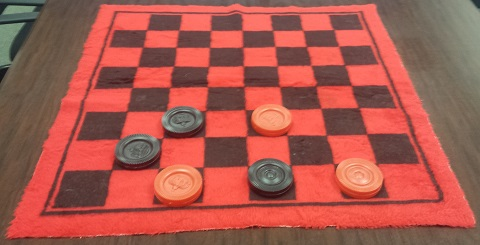
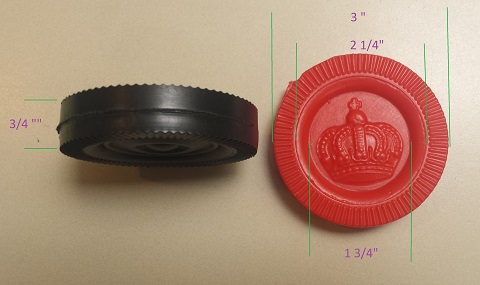

# Project Overview

The details are referenced by links. Running and creating the documentation is described.

## Project Components

The hardware is an RFID reader connected to a Raspberry Pi.
When the RFID reads a know tag, it will signal playback of music with associated images.
A 3D part will be created and a known RFID tag will be placed inside of the game piece.

* [Hardware/Software installation](md/hw-project.md) for Project 
* [Development for picture/audio/RFID](md/sw-development.md)
* [Student Create Software](md/sc-project.md)
* [Student 3D Printing](md/sc-print3d.md)

### Board Information

* Board has 64 squares
* Board dimension: TBD
* Each player has 12 pieces (total of 24 pieces)
* Find a board that fits the piece size.



### Piece Information

* Player Piece is 3" diameter
* Thickness is 3/4"
* Need to find a stl file
* Need to determine the print time
* Need to modify the stl file such that RFID tag can be placed inside of the piece.



### Running the Demo

* Once all physical connections are made, connect the power (via the usb).
  * Powering will cause the hardware to boot from the image written to the SD card.
* Log in with the default user and password.
  * Username 'pi',
  * Password 'raspberry',

* Screen 1 (Should be run first)
```
cd $HOME
screen bash
./readAudio.py
CNTRL-A
d
```
* Screen 2 (returned after detach command)
```
cd $HOME
./run-loop.sh
Hit CNTRL-C to exit program
```
To exit the program, simply hit CNTRL-C. 

* Gracefully shutdown the Pi for power off. 
This is required to avoid corruption of the OS on the SD card.
```
sudo shutdown now -h
```
Pull the USB power from the board.


### What Remains

* Connect the two screens (via the scripts).
* The readAudio script needs to:
  * sList.txt that contains the audio, picture/duration
  * The file links needs to be set to the actual file
  * The run-kill.sh needs to be run so that the run-loop can pickup new files.
* Complete the run-loop.sh
* Testing
* Need a way to move the content from the kids to the pi.

## Documentation

The documentation is created using [doxygen] (http://www.stack.nl/~dimitri/doxygen/index.html). This replaces the [WordPress website](http://www.stemfromgirls.org/janet-test/) that will soon expire.

* Create a configuration file
```
doxygen -g doxyConfig
```
* Modify the configuration file for github
```
  Line 985, USE_MDFILE_AS_MAINPAGE = README.md
  Line 035, PROJECT_NAME           = "Checkerboard Project"
  Line 000, IMAGE_PATH             = .
  LINE 000, RECURSIVE              = YES
    Suggested image size is Width=480, Height=HHH
  Line 000, OUTPUT_DIRECTORY       = ./DoxyOutput
  Line 000, INPUT                  = README.md \
                                     .
```
* Difference between default configuration and modified configuration
```
dos> diff doxyConfig doxyDefault
35c35
< PROJECT_NAME           = "Checkerboard Project"
---
> PROJECT_NAME           = "My Project"
61c61
< OUTPUT_DIRECTORY       = ../DoxyOutput
---
> OUTPUT_DIRECTORY       =
793,794c793
< INPUT                  = README.md \
<                          .
---
> INPUT                  =
868c867
< RECURSIVE              = YES
---
> RECURSIVE              = NO
930c929
< IMAGE_PATH             = .
---
> IMAGE_PATH             =
986c985
< USE_MDFILE_AS_MAINPAGE = README.md
---
> USE_MDFILE_AS_MAINPAGE =
```
* Create the output
```
doxygen doxyConfig
```
* View the output
```
../DoxyOutput/html/index.html
```
* The desired format is Markdown (MD), https://github.com/adam-p/markdown-here/wiki/Markdown-Cheatsheet  
* Suggested style, http://www.cirosantilli.com/markdown-style-guide/

## Schematics

The wiring diagram is done using the Fritizing tool.

* Fritzing download, http://fritzing.org/download/

## GitHub

The documentation is stored in GitHub. GitHub has a [series of commands](md/sw-github.md) to check changes in and out.