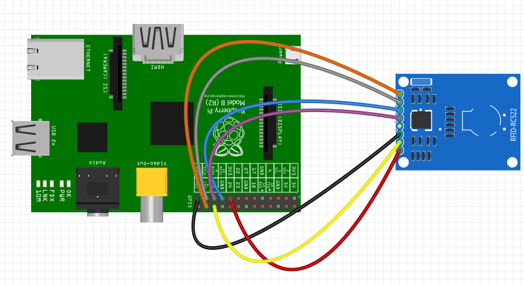

# Project Overview

The details to create the project is described along with how-to documentation.
The pending portion is the 3d print portion.

## Project Components

The hardware is an RFID reader connected to a Raspberry Pi.
When the RFID reads a know tag, it will signal playback of music with associated images.
A 3D part will be created and a known RFID tag will be placed inside of the game piece.
When the game piece comes off the board, the player will swipe the piece across the RFID reader.
The player's selected images and music will be played on a HDMI screen.

* [Hardware/Software installation](hw-project.md) for Project 
* [Development files for picture/audio/RFID](sw-development.md)
* [Student Create Software](sc-project.md)
* [Student 3D Printing](sc-print3d.md)

### Board Information

* Board has 64 squares
* Board dimension: 28" x 28"
* Each player has 12 pieces (total of 24 pieces)
* Board is made of fabric, previously purchased.


### Piece Information

* Dimensions
  * Player Piece is 3" diameter.

  * Thickness is 3/4" in height.
* Need to determine how the student will create their part and how it will be printed.


### Running the Demo

#### Set up the physical connections.
  * Connect primary connections, excluding the power (the USB Power cable).
    * The mouse is not required since this is headless.
    * Exclude the USB power until the RFID hardware is connected.
    * The HDMI is connected to a HDMI monitor with speakers.
    * The SD card is expected to be [previously installed](hw-project.md).


  * Connect the [RFID hardware](hw-rfid-rc522.md).

  * Connect the the power (via the usb cable).
    - Powering will cause the hardware to boot from the image written to the SD card.
    - A log-in screen will appear on the monitor.

#### Log in and start scripts project scripts.
The scripts were written to use all of the installed software.

* Default credentials
  * Username: pi
  * Password: raspberry
```
cd $HOME
screen bash
./readAudio.py
CNTRL-A
d
```
* Screen 2 (returned after detach command)
```
cd $HOME
./run-loop.sh
```

The default screen will display a single image and music. At this time, multiple images is not possible.

#### Swiping of RFID tags.
The RFID tag contains a unique number.
Before a tag can work, it's RFID nubmer needs to be written into the system with a single audio and multiple pictures.

The following are two example rfid's that has already been setup.


* Swipe the example RFID tag across the RFID reader.
  * The image and music will change.
* Swipe another example RFID tag across the RFID reader.
  * The image and music will change again.
* When the music is complete, 

To exit the program, simply hit CNTRL-C. 

#### Shutting down the Raspberry Pi

The Raspberry Pi needs to be shutdown gracefully.
This is to avoid corruption of the Image on the SD card.
You need to invoke the command as an administrator, therefore, use 'sudo'.
You may be prompted for a password.
The password is the same as the login password.

* Gracefully shutdown the Pi for power off. 
This is required to avoid corruption of the OS on the SD card.
```
sudo shutdown now -h
```
Pull the USB power from the board.

### What Remains

* Testing
  * Turn up the volume (via script or before hand).
* Need to determine how to place the content on a usb stick.
  * The students can create their own content (jpg, mp3) using a PC.
  * Need to document the format of the usb stick (directory, etc.)

## Documentation

The documentation is created using [doxygen] (http://www.stack.nl/~dimitri/doxygen/index.html).
This replaces the [WordPress website](http://www.stemfromgirls.org/janet-test/) that will soon expire.
This documentatino is stored in git hub: https://github.com/jgithubs/jsplayarea.

* Create a configuration file
```
doxygen -g doxyConfig
```
* Modify the configuration file for github
```
  Line 985, USE_MDFILE_AS_MAINPAGE = README.md
  Line 035, PROJECT_NAME           = "Checkerboard Project"
  Line 000, IMAGE_PATH             = .
  LINE 000, RECURSIVE              = YES
    Suggested image size is Width=480, Height=HHH
  Line 000, OUTPUT_DIRECTORY       = ./DoxyOutput
  Line 000, INPUT                  = README.md \
                                     .
```
* Difference between default configuration and modified configuration
```
gitbash> diff doxyDefault DoxyConfig
35c35
< PROJECT_NAME           = "My Project"
---
> PROJECT_NAME           = "Checkerboard Project"
61c61
< OUTPUT_DIRECTORY       =
---
> OUTPUT_DIRECTORY       = ../DoxyOutput
793c793,794
< INPUT                  =
---
> INPUT                  = README.md \
>                          .
867c868
< RECURSIVE              = NO
---
> RECURSIVE              = YES
929c930
< IMAGE_PATH             =
---
> IMAGE_PATH             = .
985c986
< USE_MDFILE_AS_MAINPAGE =
---
> USE_MDFILE_AS_MAINPAGE = README.md
```
* Create the output
```
doxygen doxyConfig
```
* View the output
```
../DoxyOutput/html/index.html
```
* The desired format is Markdown (MD), https://github.com/adam-p/markdown-here/wiki/Markdown-Cheatsheet  
* Suggested style, http://www.cirosantilli.com/markdown-style-guide/
* Mix, http://rickfoosusa.blogspot.com/2011/10/howto-use-doxygen-with-github.html

## Schematics

The wiring diagram is done using the Fritizing tool.

* Fritzing download, http://fritzing.org/download/

## GitHub

The documentation is stored in GitHub. GitHub has a [series of commands](sw-github.md) to check changes in and out.
