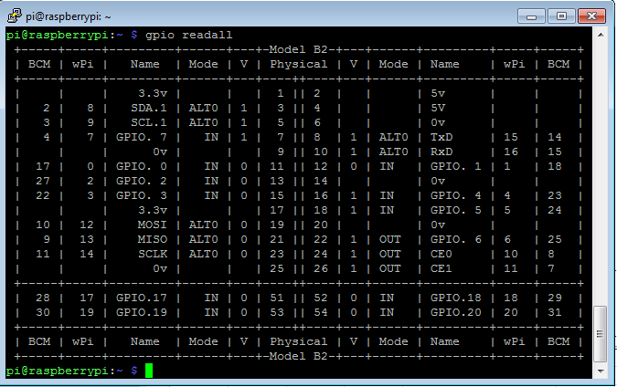

# Hardware, Raspberry Pi 3

* [Hardware Project](hw-project.md)

## Plan

The plan was this section was to describe
* Install the setup on Pi3
* Document changes and/or differences

## Hardware

RASPBERRY PI (PI)

* Determine the exact PI board being used. https://www.element14.com/community/community/raspberry-pi/blog/2016/11/21/how-to-identify-which-model-of-the-raspberry-pi-you-have
  * Proposed hardware (Raspberry Pi 3 Model B w/1G RAM)


  * Model Readings
````
Raspberry Pi Model A: 0007, 0008, 0009
Raspberry Pi Model B (Rev 1.0, 256Mb): 0002, 0003
Raspberry Pi Model B (Rev 2.0, 256Mb): 0004, 0005, 0006
Raspberry Pi Model B (Rev 2.0, 512Mb): 000d, 000e, 000f
Raspberry Pi Model A+: 0012
Raspberry Pi Model B+: 0010, 0013
Raspberry Pi 2 Model B: 1041
````
  * GPIO info, board version, Revision = 000e, http://www.raspberrypi-spy.co.uk/2012/09/checking-your-raspberry-pi-board-version/

  

  * GPIO readings, pin out, http://pi4j.com/pins/model-b-rev2.html
```
  pi> cat /proc/cpuinfo
processor       : 0
model name      : ARMv7 Processor rev 4 (v7l)
BogoMIPS        : 38.40
Features        : half thumb fastmult vfp edsp neon vfpv3 tls vfpv4 idiva idivt vfpd32 lpae evtstrm crc32
CPU implementer : 0x41
CPU architecture: 7
CPU variant     : 0x0
CPU part        : 0xd03
CPU revision    : 4

processor       : 1
model name      : ARMv7 Processor rev 4 (v7l)
BogoMIPS        : 38.40
Features        : half thumb fastmult vfp edsp neon vfpv3 tls vfpv4 idiva idivt vfpd32 lpae evtstrm crc32
CPU implementer : 0x41
CPU architecture: 7
CPU variant     : 0x0
CPU part        : 0xd03
CPU revision    : 4

processor       : 2
model name      : ARMv7 Processor rev 4 (v7l)
BogoMIPS        : 38.40
Features        : half thumb fastmult vfp edsp neon vfpv3 tls vfpv4 idiva idivt vfpd32 lpae evtstrm crc32
CPU implementer : 0x41
CPU architecture: 7
CPU variant     : 0x0
CPU part        : 0xd03
CPU revision    : 4

processor       : 3
model name      : ARMv7 Processor rev 4 (v7l)
BogoMIPS        : 38.40
Features        : half thumb fastmult vfp edsp neon vfpv3 tls vfpv4 idiva idivt vfpd32 lpae evtstrm crc32
CPU implementer : 0x41
CPU architecture: 7
CPU variant     : 0x0
CPU part        : 0xd03
CPU revision    : 4

Hardware        : BCM2709
Revision        : a22082
Serial          : 00000000225e5c36
```