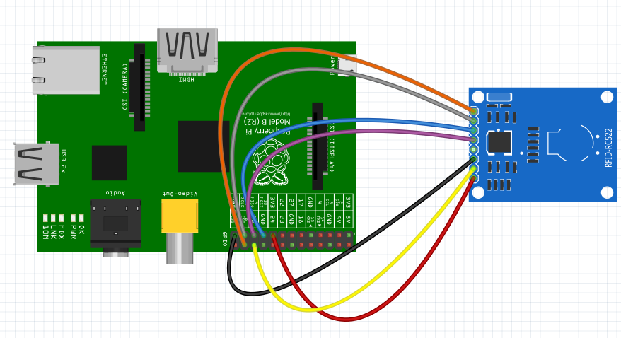

# Hardware, RFID with RC522

[Hardware, Installation](hw-project.md)

## Raspberry Pi Examples

Example 1, http://fuenteabierta.teubi.co/2013/07/utilizando-el-lector-nfc-rc522-en-la.html

Raspmer example, https://web.ist.utl.pt/~francisco.d.s.salgado/2016/01/23/reading-cards-with-rfid-rc522-and-raspberry-pi/

Francisco Salgado example, https://web.ist.utl.pt/~francisco.d.s.salgado/2016/01/23/reading-cards-with-rfid-rc522-and-raspberry-pi/

Instructables example, http://www.instructables.com/id/Raspberry-Pi-3-Model-B-MIFARE-RC522-RFID-Tag-Readi/

Guidance on RFID, http://raspi.tv/2013/how-to-use-interrupts-with-python-on-the-raspberry-pi-and-rpi-gpio

Reduce usage of python, http://raspi.tv/2013/how-to-use-interrupts-with-python-on-the-raspberry-pi-and-rpi-gpio

Sparkfun RFID Basics, https://learn.sparkfun.com/tutorials/rfid-basics

## Pi 3

* http://www.instructables.com/id/Raspberry-Pi-3-Model-B-MIFARE-RC522-RFID-Tag-Readi/


## Arduino Examples

Read only,  AddicoreRFID library, https://www.gme.cz/data/attachments/dsh.772-164.1.pdf

Read and Write, miguelbalboa library, http://playground.arduino.cc/Learning/MFRC522
```
RFID tag detected
 Tag Type: Mifare One (S50)
 The tag's number is: 153 , 38 , 31 , 0
 Read Checksum: 160
 Calculated Checksum: 160

RFID tag detected
 Tag Type: Mifare One (S50)
 The tag's number is: 230 , 58 , 23 , 7
 Read Checksum: 204
 Calculated Checksum: 204

RFID tag detected
 Tag Type: Mifare One (S50)
 The tag's number is: 37 , 28 , 113 , 139
 Read Checksum: 195
 Calculated Checksum: 195
```
## Information

Mifare Classic with 1K memory

High Frequency (13.56 MHz)

Tag Identifier is 20 bytes (160 bits). 8 bits per byte (8 bits-per-byte * 20 bytes=160 bits)

Python reads as a list [int,int,int,int,int], then converted to long (0x251C718BC3)
## Wiring Scheme



## Enable SPI on the OS

Enable SPI through the configuration program
```
sudo raspi-config 
Select Advance Options -> SPI -> Yes

NOTE: The following modification is made
sudo vi /boot/config.txt
dtparam=spi=off
dtparam=spi=on
<save>

reboot
```

Verify that spi is running
```
pi> lsmod | grep spi 
spi_bcm2835 7424 0
```

Verify that spi devices exists
```
pi> ls /dev/spi*
/dev/spidev0.0 /dev/spidev0.1
```

## Install Packages

Install python-dev libraries
```
pi> sudo apt-get update
pi> sudo apt-get install python-dev
pi> sudo apt-get install git
```

Download and install 'SPI-Py'. 
This library has C extension to the hardware.
The install will be in a special directory called 'src'.
```
pi> cd $HOME
pi> mkdir src
pi> cd src

pi> git clone https://github.com/lthiery/SPI-Py.git
pi> cd SPI-Py
pi> sudo python setup.py install
```

Download and exectue MFRC522-python. 
This is a python example to read a RFID tag.
This install will be in the 'src' directory.
```
pi> cd $HOME
pi> cd src
pi> git clone https://github.com/mxgxw/MFRC522-python.git

pi> cd MFRC522-python
pi> python Read.py
Welcome to the MFRC522 data read example
Press Ctrl-C to stop.
Card detected
Card read UID: 230,58,23,7
Size: 8
Sector 8 [0, 0, 0, 0, 0, 0, 0, 0, 0, 0, 0, 0, 0, 0, 0, 0]
Card detected
Card read UID: 153,38,31,0
Size: 8
Sector 8 [0, 0, 0, 0, 0, 0, 0, 0, 0, 0, 0, 0, 0, 0, 0, 0]
Card detected
Card read UID: 37,28,113,139
Size: 8
Sector 8 [0, 0, 0, 0, 0, 0, 0, 0, 0, 0, 0, 0, 0, 0, 0, 0]
Ctrl+C captured, ending read.
pi>
```
