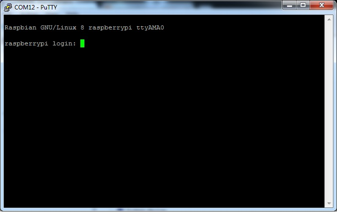

# Hardware, Serial Connection

[Hardware, Installation](hw-project.md)

[Software, Headless](sw-headless.md)

## Links

* Using a console cable, https://learn.adafruit.com/adafruits-raspberry-pi-lesson-5-using-a-console-cable

## Hardware

The following is require to connect from the usb that uses serial communication. 
The Raspberry Pi 2 and Raspberry Pi 3 uses the same cable.

* TTL Serial Cable ($9.95), https://www.adafruit.com/product/954

## Software

The following software is used to connect the Raspberry Pi through a serial cable.
A driver that supports the cable may need to be installed.
Putty is recommended for non-admin users on Windows.

* Serial and Ethernet Connection using putty, Free, https://www.chiark.greenend.org.uk/~sgtatham/putty/latest.html

## Enabling Serial Communication

Serial connection is convient because the developer's desktop can be used for software installation commands.
However, the special serial cable needs to be purchased.
This serial cable will also power the Pi, however, not recommended for this project.

The serial connection is not enabled by default.
Run Raspi-config and enable the serial connection.

## Serial Connection

On the Raspberry Pi, there exists two rows of pins.
The USB serial cable will connect from the laptop to these pins.

The first pin is located on the bottom left in the diagram below.
The pins are numbered as follows:

Pins | Col 1 | Col 2 | Col 3 | Col 4 | Col 5 | Col 6 | Col N
----- | ----- | ----- | ----- | ----- | ----- | ----- | -----
Top Pins | 2 | 4 | 6 | 8 | 10 | 12 | ...
Btm Pins | 1 | 3 | 5 | 7 | 9 | 11 | ...

The following connection table are from two perspective.
Notice that the red wire is not connected.
<table>
  <tr>
    <th>Serial Perspective</th>
    <th>Hardware Perspective</th>
  </tr>
  <tr>
    <td>
Wire | Pin
---- | ---
Red | Not Connected
Black | 6
White | 8
Green | 10
    </td>
    <td>
Pin | Wire
---- | ---
2 | Not Connected
4 | Not Connected
6 | Black
8 | White
10 | Green
    </td>
  </tr>
</table>

This is the recommended wiring for the project.
The power will NOT come from the serial cable, therefore, do not attach the red wire.
The board will be powered by the micro usb cable (not shown).

Once the USB cable is plugged into Windows, use 'Device Manager' to determine what COM port was assigned.
The driver name is dependent on the installed driver.

Start putty and enter the following parameters.
In this case the images shows COM 7, however, our connections are as follows:

  * Serial Parameters / Connections
    * Baudrate: 115200
    * Connection Type: Serial
    * USB Ports
      * Top (Com 6)                   Front (Com 12)
      * Bottom (Com 5)                Back  (Com 13)

Once connected, hit the carrage return to obtain a login prompt.
In the image below, the com port should match the port assigned by 'Device Manager'.
This example below shows a login example, however, note that the COM port is NOT correct.

