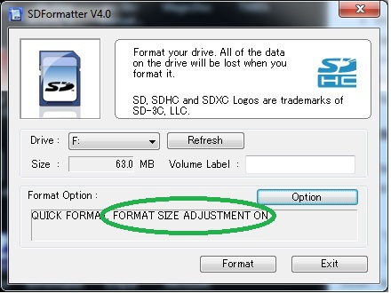
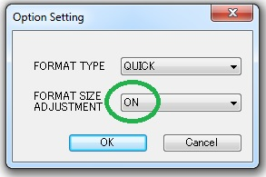
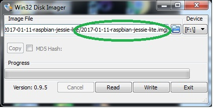

# Software, Format and Burn Image

[Hardware, Installation](hw-project.md)

[Software, Headless](sw-headless.md)

## Hardware

* SD Card, 8GB Micro SD w/Adapter, (9.95), https://www.adafruit.com/product/2692
  * 8 GB is required for the GUI boot-up and headless boot-up
  * 32 GB or lower is good for headless

## Software

* Image Burner, Write IMG files to a SD Card, Free, https://sourceforge.net/projects/win32diskimager/

* San Disk Formatter, Obtain the use of the full SD card, Free, https://kb.sandisk.com/app/answers/detail/a_id/14827/~/using-sd-formatter-tool-to-restore-full-capacity-on-sdhc%2Fsdxc-cards

## Adjusting the SD Size

When the SD card is inserted into the Pi, the physical SD size is changed upon first boot.
If rewriting a image to the SD card, the size does not adjusted back to the manufacture size.
It is usually smaller. The "San Disk Formatter" is use to set the SD back to the manufacturer size.

Select 'Option' and set the 'Format Size Adjustment' option to 'ON'. Select 'Ok'

This will return to the main screen.
Select 'Format' and do not touch the SD card. Select 'Exit' to exit the program.
The SD card is now ready for a image to be written.

## Writing image to the SD

The image writer used is the Win32DiskImager. This image tool's install instruction is on the Raspbian site.

* Take note of the file path for the image file and it's filename.
* Insert the SDCard and take note of the assigned drive to the SD card.
* Start the image executable.
  * Select the image file that was uncompressed.
  * Select the drive to write to.
  * Select 'Write' to start the burn process.
  Time will vary based on the image version selected.
  It will take a significant amount of time depending on the computer being used.
  * Once complete, a "Write Successful" box will appear, select 'OK'. Then select 'Exit'
* Properly unmount the SDCard.