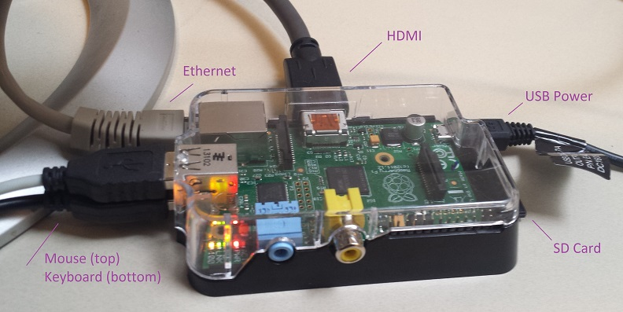
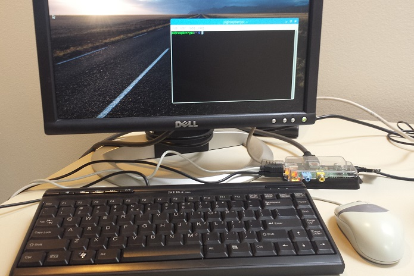

# Software, Headless

[Hardware, Installation](hw-project.md)

## Hardware

* Raspberry Pi, Model B, "Raspberry Pi(c)2011.12", ($29.95), https://www.adafruit.com/product/1914
* TTL Serial Cable ($9.95), https://www.adafruit.com/product/954
* HDMI Cable, HDMI to DVI ($5.99), https://www.amazon.com/AmazonBasics-Input-Output-Adapter-Cable/dp/B014I8UQJY 
* HDMI to VGA ($6.79), https://www.amazon.com/eBerry-Connector-Transmitter-CONVERSION-Transmission/dp/B01F75VES4/ref=sr_1_4?s=aht&ie=UTF8&qid=1485810552&sr=1-4&keywords=hdmi+to+vga 
* HDMI to HDMI ($6.99), https://www.amazon.com/AmazonBasics-High-Speed-HDMI-Cable-Standard/dp/B014I8SSD0/ref=sr_1_3?s=aht&ie=UTF8&qid=1485810655&sr=1-3&keywords=hdmi+to+hdmi 

## Operating System

Raspbian-Lite Image, January 2017, Username 'pi', Password 'raspberry', Serial Baud Rate '115200' (Free)

## Burn the Image

Download the image from the Raspbian site. 
* There are two version (raspbian-jessie and raspbian-jessie-lite).
* Use the lite version, http://downloads.raspberrypi.org/raspbian_lite/images/
* The lite version is headless meaning it has no GUI front-end. It is very small compared to the non-lite version.

When the image is downloaded, uncompressed the zip file. 
* Uncompresseing will result in a single *.img file. 
* [Format the SD Card and burn the image file](sw-format-sd.md) to the SD Card.
* Proceed with Direct Connect, updates, and configuration.

## Direct Connect

* Connect the HDMI cable and turn monitor ON.
* Connect the keyboard
* Connect the mouse (not necessary for headless)
* Connect the [ethernet cable](hw-ethernet-connect.md) and/or the [serial cable](hw-serial-connect.md) (not shown).
* Connect the audio. Initially start with earphones, configuration thru HDMI will happen later.
* Insert the SD card.





* Once all physical connections are made, connect the power (via the usb).
Powering will cause the hardware to boot from the image written to the SD card.
  * The root file system will be resized at first boot.
* Log in with the default user and password.
  * Username 'pi',
  * Password 'raspberry',

### Configuration Connection(s)

The first step after powering on the Pi with a OS images is configuration.
There is a problem where connecting to the operating system are not always intuitive because features have not been turned on.
All that needs to be done run the configuration program for the desired connections. 
Connection options are Keyboard/Mouse/Monito, Ethernet, and/or Serial.
These connections all have their own limitations. 
Once the connection is made the default has to be modified to provide proper access.

* Direct connect is the connecting a Keyboard/Mouse/Monitor (described above) directly to the Raspberry Pi.
This is initially required to get ethernet and/or serial working.
This requires the most amount of hardware.
The only special hardware is the HDMI cable that is based on the type of monitor you are using.

* [Ethernet](hw-ethernet-connect.md) is the best method because it requires a single Ethernet cable.
This connection uses the [SSH Server](sw-ssh-server.md) and a router the assigns an ethernet address.

* [Serial](hw-serial-connect.md) is straight forward, however, a special serial cable is required.


## Configuration

Once a connection is made, login to the Raspberry Pi.
Update the operating system.
This is mandatory because some configuration steps will not work as described.
```
sudo apt-get update
```

Update the keyboard to english. 
This is require to get some default keystrokes ("|") working.
Changing keyboard using the configuration tool is not intuative.
```
vi /etc/default/keyboard
Change
XKBMODEL="pc05"
XKBLAYOUT="gb"
  to
XKBMODEL="pc05"
XKBLAYOUT="us"

sudo reboot
```

When the update is complete, configure the system.
```
sudo raspi-config
```
Once the configuration is started, some changes are required see [“Americanizing” the Raspberry Pi](http://rohankapoor.com/2012/04/americanizing-the-raspberry-pi/) for details.
  * Enable the SSH server to enable Ethernet connections (Advanced Options)
  * Set the locales to en_US.UTF-8 (unselect en_GB.UTF-8, C.UTF-8)
  * Set the time zone to US and Mountain
  * Set the time
  * Set the hostname (optional)
  * Set the password (optional)
There are more optional configuration mention in the above link. However, reboot the Pi to accept the minimal.

```
sudo reboot
```


## Full Shutdown

We now need to change how the Pi is powered (if you used the Serial Connection). 
Gracefully shutdown the Pi to avoid corruption of the OS on the SD card.
```
sudo shutdown now -h
```
When the Pi is halted, you will see '[...] reboot: Power down'.
It is now safe to remove the Serial cable from the Pi.
Power the Pi from the USB connection.

## Update the Operating System:

The Raspberry Pi OS was installed when the image was burned to the SD card.
By default, there is no internal hardware with the OS, it is on the SD card.
The operating system was configured such that the date/time/time zone was correct.
The SSH server was enabled such that we can access the Pi using Ethernet. We then verified that Pi can communicate with our PC and web.
```
df -h
Filesystem       Size    Used  Avail  Used%  Mounted on
/dev/root         15G    3.6G    11G    26%  /        
devtmpfs         214M       0   214M     0%  /dev
tmpfs            218M       0   218M     0%  /dev/shm
tmpfs            218M    8.5M   209M     4%  /run
tmpfs            5.0M    4.0K   5.0M     1%  /run/lock
tmpfs            218M       0   218M     0%  /sys/fs/cgroup
/dev/mmcblk0p1    63M     21M    42M    33%  /boot
tmpfs             44M       0    44M     0%  /run/user/1000
```
For installs, look at '/'. Size changes from 3.6 to 3.7, then to 4.2G.  Upon second update old files are in /home/pi/oldconffiles.
```
df -h
Filesystem       Size    Used  Avail  Used%  Mounted on
/dev/root         30G   841MG    28G     3%  /        
devtmpfs         214M       0   214M     0%  /dev
tmpfs            218M       0   218M     0%  /dev/shm
tmpfs            218M    8.4M   209M     4%  /run
tmpfs            5.0M    4.0K   5.0M     1%  /run/lock
tmpfs            218M       0   218M     0%  /sys/fs/cgroup
/dev/mmcblk0p1    41M     21M    42M    51%  /boot
```
The best method is to login through Ethernet.
